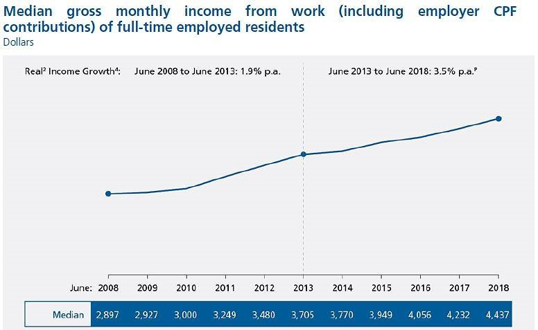
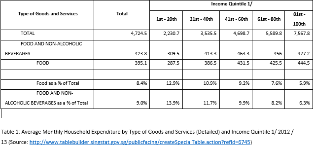

```{r load_libraries}
library(tidyverse)
library(sf)
library(tmap)
library(googlesheets4)
library(janitor)
library(corrr)
library(knitr)
library(rhandsontable)
```
1.	Introduction 

Singapore has experienced growth in median wages from $2,897 in 2008 to $4,437 as reported in Comprehensive Labour Force Survey done by Ministry of Manpower (MOM) (CNA, 2018). This steady increase in salary could be attributed by a higher proportion of the workforce who are matured graduates. A real increase of 3.5% p.a. from June 2013 to June 2018 on the average is encouraging. However, this does show the extent of increase of the low-income households and those are not in the workforce.
```{r}

```
Ageing population in Singapore has cast the need for the seniors to be able have a good standard of living amidst rising costs. The cost of living in Singapore is increasing year-by-year as Singapore is a price follower for world commodities and most of the items are imported. Inflation can be slowed by floating the exchange rate, but the real cost will be felt more by the vulnerable groups. For the lowest quintile households, the percentage of expenditure is higher at 13.9% compared to the middle quintile households at 10%, because the food is an essential item for daily living. 
```{r}

```
This inspired our group to investigate the price of food and beverage using Bedok Interchange Food Centre as a benchmark with the neighbouring 1km radius of similar offerings. The study aims to find out how hawker food prices are interpreted by diners based on the affordability and the environment and their willingness to travel. We will formulate an index to account for the food prices in each of hawker centres and kopitiams (collectively termed as eateries). This enable us to compare the prices across space so that residents can make informed choice when choosing a eatery. 

2.	Existing Literature

The idea was used in a working paper done by Institute of Policy Studies (IPS) (Goh et al., 2017). The authors constructed a Makan Index using a standard set of food items that are close to the choice of food in Singapore, by adding the average price of each item and divide the sum of total by the lowest aggregate of all areas. The scale of the study is 26 planning areas and concluded non-mature planning areas are relatively higher than matured. They also see relationship between socioeconomic indicators and cost of eating.
There is also a study across the global scale (Oxfam, n.d.) with 125 countries by examining adequacy of food, affordability, food quality and diabetes and obesity with data obtained from available global sources wherever time frame.

3.	Choice of Location

Bedok is chosen as a neighbourhood because it is an established matured estate with development tracing back to 1963. With residents from all age groups as more HDBs are built throughout the decades and having several eateries nearby, and the recent upgrade of the Bedok Interchange Hawker Centre has motivated us to investigate how diners and residents perceive the prices of food.
In 2013, Bedok Mall opened its doors to the public, and with it, Bedok Bus Interchange was moved into the mall, so that the hawker centre is improved environment with relatively cleaner air, tables and floor. Subsequently, it was decided that the hawker centre and its surrounding area was to be redeveloped, to include a sparkling new hawker centre, coupled with open plazas for events. It was a welcomed move, as the old hawker centre could no longer serve the needs of the residents and it was time to discard the dirt and dust that had accumulated over the past 20 years. Thus, the new hawker centre was opened in 2014, managed by Foodfare, with brand new stalls offering new selections as well as old stalls that used to operate at the old hawker centre returned to the new centre. 

4.	Methodology

4.1.	Observation of Prices

We travelled to 11 other eateries in Bedok Neighbourhood which is about 1km radius from Bedok Interchange to collect the data for the prices of five identified items. If the eatery does not sell the particular item, it is left as blank. The choice of these items is adapted from the IPS study as the researchers found these items more common in Singapore. 

1.	Chicken Rice
2.	Economic Rice (2 vegetables and 1 meat)
3.	Mee Rebus
4.	Kopi-O
5.	Iced Milo. 

4.2.	Survey Conducted

A total of 35 respondents were surveyed  by face-to-face at the eateries to understand their perception of the eatery they are at as compared to Bedok Interchange Food Centre.  We conducted the surveys on two different days around lunch hours. 
```{r}
my_tbl <- tibble::tribble(
  ~Scale, ~Strongly.Disagree, ~Disagree, ~Neutral, ~Agree, ~Strongly.Agree,
      NA,                  1,         2,        3,      4,               5
  )

require(rhandsontable)
rhandsontable(my_tbl, rowHeaders = NULL,
               digits = 3, useTypes = FALSE, search = FALSE,
               width = NULL, height = NULL)
```
A scale of from one to five (except Question 5) is according to the descriptors were asked on at the particular establishment compared to Bedok Interchange. For example, a respondent is being asked at Blk 216 Bedok North Food Centre will make reference to Bedok Interchange. The six questions would able to gauge the prices and comfort level of eating at the location.
```{r}
my_tbl <- tibble::tribble(
  ~X.,                                                                    ~Question, ~Parameter.Name,
    1,                        "Do you think the  food expensive at this location? ",        "food_P",
    2,                           "Do you like the  food/ambience at this location?",        "food_Q",
    3, "Do you think  that the food at Bedok Interchange Food Centre is expensive?",    "int_food_P",
    4,          "Do you like the  food/ambience at Bedok Interchange Food Centre? ",    "int_food_Q",
    5,          "Is this location  near your workplace or home? (1 = far,5 = near)",          "near",
    6,                        "Are you willing  to travel to interchange for food?",   "will_travel"
  )

require(rhandsontable)
rhandsontable(my_tbl, rowHeaders = NULL,
               digits = 3, useTypes = FALSE, search = FALSE,
               width = NULL, height = NULL)

```
4.3 Constructing the Jiak Index

"“"Jiak" means to eat in Hokkien, a local colloquial dialect. A value of Jiak Index is derived for every eatery. It places equal weightage on the average price of the food and drink items. This means half of the index is based on food and half on beverage. It is mathematically as follows:

```{r}
include_graphics("formula.png")
```
The Jiak index differs from the Makan Index used by IPS in several ways. Firstly, it is computed using average food price and average drinks price. This approach was taken as some locations did not sell certain foods, e.g. Mee Rebus. As such, taking aggregate of prices would be impossible with missing data, thus average food price was chosen, since the foods chosen were quite similar in prices and taking average would not be unfair for places that did not offer certain choices. Secondly, this approach is more superior than the Makan Index, as not only it gives a gauge of how expensive a place is, it also tells the average cost of having a meal at a location, given that a patron would order one food and one drink for a meal. 

4.4 Constructing the Cheap and Good Index

The Cheap and Good Index (CnG Index) serves as a supplementary index to give information about the patrons’ perception of quality and prices. It is calculated by taking the quality score (obtained from “do you like food/ambience at this location?) divided by the price score (from “do you think the food is expensive at this location?). Therefore, better food and cheaper prices will score high on the index. This index differs from the Jiak index as it is based on consumers’ perceptions, not prices set by the hawkers. It also gives a quick reference for patrons to know where to find foods that taste well and affordable. 

```{r}
kml <- read_sf("kml")
```
```{r}
# prices_data <- read_sheet("1FIXl42VZGz9_tacIepXuBIIRv7joqmhaiG7o91snb60")
# survey_data <- read_sheet("1Xoz9qN6_ac3mhZXWaq_KgcbNzq5pn4NsnTjK9LETVNs")
prices_data <- read_csv('prices.csv')
survey_data <- read_csv('survey.csv')
```

5.	Analysis of Results

5.1.	Prices

```{r}
boxplot.matrix(prices_data %>% 
                 filter(`Location of hawker centre`!="Bedok Interchange Hawker Centre") %>% 
                 clean_names() %>% 
                 rename(C.rice = price_of_chicken_rice, E.rice = price_of_economic_rice_2_veg_1_meat, M.Rebus = price_of_mee_rebus, Milo = price_of_iced_milo, Kopi_o = price_of_kopi_o) %>% 
                 select(C.rice,E.rice,M.Rebus,Milo,Kopi_o) %>% 
                 as.matrix(), range = 0)
points(c(1,2,3,4,5),c(3.0,3.1,2.5,1.7,0.9),pch=4)
```
This plot shows the distribution of prices around Bedok Interchange Hawker Centre. The corresponding prices at Bedok Interchange Hawker Centre are marked with ”X”. 

Milo and Kopi-O have a smaller interquartile range, which means the prices are very close in Bedok area. It is interesting to note that the Bedok Interchange price is cheaper for Kopi-O but more expensive for Milo. This shows there is some market competition in prices.

Chicken rice has a larger range which likely largely differ in terms of quantity, location and taste, hence $2 is the minimum and $3.50 is the maximum. Bedok Interchange price equals to the median.

Economic rice has a median of $3, and the price at Bedok Interchange slightly higher. Prominent and location of Bedok Interchange can possibly charge a higher price as it is more accessible.

Mee Rebus is only found in three of the 12 places we surveyed, hence it does not represent well in Bedok. 

With two items above median, two below median and one at median for the items at Bedok Interchange suggests there is some price differentiation among the hawkers and is not systematically varied.


```{r}
prices_data <- merge(prices_data,kml, by = "row.names")%>% 
 select(-Name,-Description,-Row.names,-Timestamp) 
```

```{r}
  distance<-  st_distance(prices_data$geometry) %>% 
  as.tibble() %>% 
  select(V1) %>%   
  rename (distance = V1)
```

```{r}
prices_data <- merge(prices_data,distance, by = "row.names") %>% 
  select(-Row.names) 
```
```{r}
 prices_data<- prices_data %>% 
  as.tibble() %>% 
  select(-City) %>% 
  arrange(distance) %>% 
  clean_names()%>% 
  mutate(average_food_price = rowMeans(.[,2:4],na.rm = T) %>% signif(.,3)) %>% 
  mutate(average_drink_price = rowMeans(.[,5:6])) %>% 
  mutate(Jiak_index = average_drink_price+average_food_price) %>% 
 .[c(1,2,3,4,5,6,9,10,11,7,8)] 
```
```{r}
prices_data 
```

```{r}
combined_data<- survey_data %>% 
  clean_names() %>% 
  select(-timestamp,-race,-religion) %>% 
  group_by(location) %>%
  summarise_all(mean) %>% 
  fashion() %>% 
  left_join(prices_data, by = c("location"="location_of_hawker_centre"))
  
```


```{r}
combined_data %>% 
  st_sf() %>% 
  st_transform(3414) %>% 
  filter(location=="Bedok Interchange Hawker Centre") %>% 
  st_buffer(1000) %>% 
  tm_shape() + tm_polygons(alpha = 0)
```
5.2.	Survey


```{r}
combined_data %>% 
  st_sf() %>% 
  tm_shape() + tm_bubbles(col="willing_to_travel_to_interchange_for_food", palette = "Blues")
```

Spatially, the willingness to travel for food is lesser if the eatery surveyed is further away from Bedok Interchange. This can be explained by having to incur a higher transaction cost of travel given they have an eatery nearby.

```{r}
combined_data %>% 
  st_sf() %>% 
  tm_shape() + tm_bubbles(col="is_interchange_food_expensive",palette = "Reds")
```
Respondents who has done the survey further away perceived that Bedok Interchange is more expensive. This also relates to the willingness to travel to Bedok Interchange for food, as the they do not travel since they think is expensive.
```{r}
combined_data %>% 
  st_sf() %>% 
  mutate(is_interchange_food_ambience_good = as.numeric(is_interchange_food_ambience_good)) %>% 
  tm_shape() + tm_bubbles(col="is_interchange_food_ambience_good",n=5,palette = "Greens")
```
As for the ambience, majority place a value of 2 to 4. There is a pattern of increasing preference as it gets further for four of the eateries. The rest have varied responses, which might be biased as they are sitting under a fan or is less crowded at the point they visit.

5.3.	Jiak Index
```{r}
tmap_mode("view")
combined_data %>% 
  st_sf() %>%  
  mutate(is_food_ambience_good_here = as.numeric(is_food_ambience_good_here)) %>% 
  tm_shape()+tm_bubbles(col = "Jiak_index", size = "is_food_ambience_good_here", scale = 3, perceptual =T)  + tm_shape(combined_data %>% 
  st_sf() %>% 
  st_transform(3414) %>% 
  filter(location=="Bedok Interchange Hawker Centre") %>% 
  st_buffer(1000) ) + tm_polygons(alpha = 0) + tm_scale_bar()
```
The size of the bubble correspond to the survey result for whether the items are good in quality. Blk 122 Bedok North Chang Long Coffeeshop has a higher average score for taste and a mid-range Jiak Index. Hence, it can be considered as a good place for affordable and quality food. A 1km buffer is added to illustrate proximity of eateries.
The Jiak Index is higher at the immediate neighbours of Bedok Interchange, as seen by the darker shade of red. As the eatery is located further, Jiak index generally decreases. An outlier at Blk 56 New Upper Changi can be explained by the higher than average Chicken Rice at $3.50 and is near the main road.

5.4.	Cheap and Good Index
```{r}
combined_data %>% 
  mutate(CnG_index = as.numeric(is_food_ambience_good_here)/as.numeric(is_food_expensive_here)) %>%
  st_sf() %>% 
  tm_shape() + tm_bubbles(col = "CnG_index")
```
The lowest CNG is at Blk 123 Bedok North which means it is perceived to be cheap and of good quality in all the places. Blk 56 New Upper Changi has the highest CNG of 1.75, that is the least recommended by the respondents. 

5.5.	Correlations
```{r}
combined_data %>% 
  select(is_food_ambience_good_here,is_food_expensive_here,is_interchange_food_ambience_good,is_interchange_food_expensive,willing_to_travel_to_interchange_for_food,is_the_eating_place_near_work_home_1_far_5_near,Jiak_index,distance) %>%
  mutate_if(is.character,as.numeric) %>% 
  rename(food_Q = is_food_ambience_good_here, int_food_P = is_interchange_food_expensive, food_P = is_food_expensive_here, will_travel = willing_to_travel_to_interchange_for_food, int_food_Q = is_interchange_food_ambience_good, near = is_the_eating_place_near_work_home_1_far_5_near) %>% 
  correlate() %>%
rearrange() %>%
shave %>%
rplot(print_cor = T)
```
Q is quality while P is price.

Bedok Interchange prices has a strong negative correlation with the Jiak Index -0.68. This shows that cheaper interchange food perceived by the respondents will increase the Jiak Index, which is more expensive overall. This can be illustrated with a scatter plot and “line of best fit” as below. Looking at coefficients whose absolute values are close to or >0.5, Jiak index increases with food quality. As Jiak index increases, they believe interchange food is cheaper. Further eating places tend to offer lower food quality; patrons staying further from interchange are less willing to travel to interchange. Willingness to travel increases with perception of interchange food quality, and patrons who stay near their eating place are willing to travel to interchange. They also believe interchange food quality is good even though they stay near their eating place. 

```{r}
plot (combined_data $distance , combined_data$Jiak_index, xlab="distance", ylab="jiak index") 
 abline(lm(combined_data$Jiak_index~combined_data $distance ))
```
Jiak index has a moderate positive relationship with food quality perceived by the respondent with a correlation coefficient of 0.47. This means that the price they paid can be enjoyed for a better taste. This can be supported by a research done by Cornell University where diners rated the food higher if it is more expensive ceteris paribus (Short, 2017).
```{r}
plot (combined_data$is_food_ambience_good_here, combined_data$Jiak_index, xlab="food quality", ylab="jiak index") 
 abline(2.28,0.52)
```
Jiak Index has a moderately positive relationship with food quality with a correlation coefficient of 0.47. This shows the amount they pay correspond to the quality they perceived to get from it.
```{r}
plot (combined_data$is_food_expensive_here, combined_data$Jiak_index, xlab="perception of food prices", ylab="jiak index") 
abline(3.94,0.109)
```
Jiak index as a weak positive relationship of 0.21 with perception of food prices. There is limited evidence that actual price and the price they perceived to be.
```{r}
plot(combined_data$willing_to_travel_to_interchange_for_food,combined_data$is_interchange_food_expensive, xlab = "willingness to travel to interchange", ylab = "perception of interchange prices")
abline(lm(combined_data$is_interchange_food_expensive~combined_data$willing_to_travel_to_interchange_for_food))
```
Willingness to travel shows a strong negative relationship with perception of interchange price and food quality at the surveyed eatery. Respondents perform rationally because they are more willing to travel to interchange if they think it is cheaper to eat at Bedok Interchange compared to the place they were surveyed. An outlier with responses at willingness to travel value 3 and perception of interchange price 4 might have a biased judgement.  
```{r}
plot (combined_data$willing_to_travel_to_interchange_for_food,combined_data$is_food_ambience_good_here, ylab="food quality at the eating place", xlab="Willingness to travel to interchange") 
abline(3.8, -0.0311)
```
With regards to the food quality they are at, the higher they value the quality has lesser incentive to to travel to interchange. This suggests they are satisfied with the current place. As the correlation coefficient is 0.21, the relationship is weak.
```{r}
combined_data %>% 
  arrange(Jiak_index)
```


```{r}
combined_data %>% 
  
  mutate(CnG = as.numeric(is_food_ambience_good_here)/as.numeric(is_food_expensive_here)) %>% 
  arrange(desc(CnG))
```
6.	Limitations and Potential for Further Study

The scope of this study is limited to one neighbourhood Bedok in Singapore. The demographics and geographical location would matter in prices of everyday food options, which will differ in other neighbourhoods. Another neighbourhood of similar scale can be studied to compare the index.
The historical prices of the items can be captured to show a trend across time. With Singapore importing most of the food, it is worth to investigate how price movement within a period of time. With inflation and price adjustments made periodically, it can be expanded to a time series study to investigate if the increase is within a acceptable range.  Competition watchdog Competition and Consumer Commission of Singapore has been tracking coffee stall, which is useful to policy makers to ensure that there is open and transparent competition and no collusion (Today, 2017).
The interviewees we approached have different personal experiences and may not reflect the general trend in society. By taking the average prices of the item assumes that the items are homogenous, that is of the same quantity and taste. This does not show only Bedok residents dining habits and their perceptions, as there were students and workers who works in the area who are not staying in Bedok. The postal code of the respondent would possibly be captured to ascertain the relationship with their place of work or residence with the food option.
The racial composition of Bedok is not truly reflected in the survey responses, that may not resonate well with the neighbourhood. It could be that the timing we visited does not have a bigger representation at that time. We tried to interview Malays and Indians but they rejected to share their views. 

```{r}
my_tbl <- tibble::tribble(
      ~Race, ~Bedok.Planning.Area, ~Survey.Respondents.Proportion,
  "Chinese",                "72%",                          "91%",
   "Indian",                 "9%",                           "3%",
    "Malay",                "15%",                           "6%",
   "Others",                 "4%",                           "0%"
  )

require(rhandsontable)
rhandsontable(my_tbl, rowHeaders = NULL,
               digits = 3, useTypes = FALSE, search = FALSE,
               width = NULL, height = NULL)

```


Table 3: Race Breakdown of Bedok and Respondents 

By choosing five items may not able to mimic an average person’s choice. A expanded to eight items may be a better way to study.
As this does not take into consideration of air-conditioned eatery, the premium on better ambience is not captured. Also, most of the interviewees are of the older population thus they have a different benchmark and perception on prices and environment compared to millennials. Age group can be added in the study to investigate whether ageism can skew the results.

7.	Conclusion

Based on the Jiak Index, Bedok Interchange ranked seventh. On the cheap and good index, it is ranked third. Hence, it is not the most expensive place. Despite the centralised location with steps away from MRT, it can offer value-for-money meals. The respondents are generally satisfied with the eatery and do not find a strong incentive to travel to the interchange for food.

8.	Bibliography

CNA (2018, November 29). Incomes in Singapore up, with median salary rising above S$4,400: MOM report. Retrieved from https://www.channelnewsasia.com/news/singapore/average-salary-2018-singapore-median-income-employment-10979844
Goh CH, Leong ZH & Lim AMV. Makan Index 2017: An Indicator For Cost Of Eating Out In Singapore. Institute of Policy Studies. Retrieved from: https://lkyspp.nus.edu.sg/docs/default-source/ips/working-paper-29_makan-index-2017_150518.pdf?sfvrsn=2792610a_2
Oxfam. (n.d.). Global Food Index :: Oxfam. Retrieved from https://www.oxfam.org.uk/what-we-do/good-enough-to-eat
Short, K. (2017, December 07). Do Higher Prices Make Food Taste Better? Science Says Yes. Retrieved from https://www.huffingtonpost.com/2014/05/05/expensive-food-taste_n_5267707.html
Today (2017, July 08). MTI, competition watchdog monitoring price hikes by several coffee stalls. Retrieved from https://www.todayonline.com/singapore/mti-competition-watchdog-monitoring-price-hikes-several-coffee-stalls

```{r}
survey_data %>% 
  clean_names() %>% 
  tabyl(religion) 
```
```{r}
survey_data %>% 
  clean_names() %>% 
  tabyl(race) 
```
